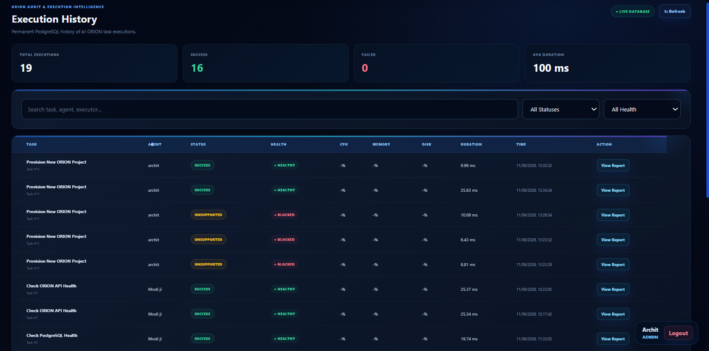

ORION — Autonomous Digital Company Operating System


ORION is a cloud operations and automation platform deployed on AWS EC2.
It combines infrastructure monitoring, controlled task execution, deployment automation, PostgreSQL-backed execution history, JWT authentication, role-based access control, infrastructure diagnostics, and administrator-controlled provisioning.
> ORION was built as a Cloud / DevOps portfolio project to demonstrate AWS, Linux administration, backend engineering, monitoring, security, deployment automation, and production-oriented system design.
---
🚀 Features
Real-time AWS EC2 monitoring
CPU, memory, and disk monitoring
FastAPI, Nginx, and PostgreSQL health checks
Controlled multi-executor task engine
Persistent execution history
Executor-aware reports
JWT authentication
Admin / Operator / Viewer RBAC
Administrator-only provisioning
Controlled deployment automation
Frontend backup before deployment
Nginx configuration validation
HTTP health verification
Rollback workflow
Live cloud operations dashboard
---
⚙️ Multi-Executor Task Engine
ORION routes supported task types to approved backend executors.
Current executors include:
System Health
Nginx Health
PostgreSQL Health
ORION API Health
Process Analysis
Storage Analysis
Network Diagnostics
Security Audit
Controlled Provisioning
```text
Task
 |
 v
Executor Detection
 |
 +--> System Health
 +--> Nginx Health
 +--> PostgreSQL Health
 +--> API Health
 +--> Network Diagnostics
 +--> Security Audit
 +--> Provisioning
```
ORION does not expose unrestricted shell execution through the task engine.
---
🧠 Controlled Provisioning
Administrators can run approved provisioning tasks such as:
```text
Create a new project named Nova Cloud Platform.
Create a new AI employee named Atlas with role Cloud DevOps Engineer.
Create a production deployment named Nova Production with version v1.0.0.
```
ORION can create and link:
```text
Project
 |
 +--> Digital Workforce Record
 |
 +--> Deployment
```
Provisioning is restricted to the Admin role.
---
🚢 Deployment Automation
```text
Deployment Request
       |
       v
FastAPI
       |
       v
Restricted sudo
       |
       v
Approved Deployment Helper
       |
       +--> Backup existing frontend
       +--> Deploy approved files
       +--> Validate Nginx
       +--> Reload Nginx
       +--> HTTP verification
       +--> Rollback on failure
       |
       v
DeploymentRun stored in PostgreSQL
```
---
🔐 Authentication & RBAC
Admin
Full resource management, deployment, and provisioning access.
Operator
Can run approved operational tasks and deployments.
Viewer
Read-only access to dashboards and reports.
Authentication includes JWT, bcrypt password hashing, backend authorization, and browser session storage.
---
📊 Execution Reports
Execution history includes:
Executor
Task
Assigned employee
Status
Health
Start and completion time
Duration
Hostname
Warnings
Recommendations
Executor-specific result data
Example PostgreSQL report:
```text
SERVICE       DATABASE       LATENCY       VERSION
ACTIVE        CONNECTED      0.27 ms       15.19
```
---
🏗️ Architecture
```text
                     INTERNET
                         |
                         v
                    Nginx :80
                         |
              +----------+----------+
              |                     |
              v                     v
         Frontend              /api/*
                                    |
                                    v
                              FastAPI :9000
                              127.0.0.1 only
                                    |
               +--------------------+--------------------+
               |                    |                    |
               v                    v                    v
          JWT / RBAC         Executor Engine      Deployment Engine
                                    |                    |
                                    |                    v
                                    |             Restricted sudo
                                    |                    |
                                    |                    v
                                    |            Deployment Helper
                                    |
                                    v
                               SQLAlchemy
                                    |
                                    v
                               PostgreSQL
```
---
☁️ Technology Stack
Cloud: AWS EC2, EBS, Security Groups  
Backend: Python, FastAPI, Uvicorn, SQLAlchemy  
Database: PostgreSQL 15  
Infrastructure: Amazon Linux, Nginx, systemd, Bash  
Frontend: HTML, CSS, JavaScript  
Security: JWT, bcrypt, RBAC, restricted sudo  
Development: Git, GitHub, REST APIs, curl, SSH
---
🗄️ Database
Main PostgreSQL tables:
```text
projects
agents
tasks
deployments
task_executions
deployment_runs
security_findings
settings
users
```
---
👥 Digital Workforce
Name	Role
Sentinel	Cloud Infrastructure Engineer
OrionOps	Cloud Infrastructure Engineer
Atlas	Cloud DevOps Engineer
These are controlled application workforce records used by ORION's task system, not autonomous LLM agents.
---
📁 Project Structure
```text
ORION/
├── backend/
│   ├── app/
│   │   ├── api/
│   │   ├── models/
│   │   ├── database.py
│   │   └── main.py
│   ├── create_admin.py
│   ├── create_tables.py
│   ├── reset_admin_password.py
│   ├── requirements.txt
│   └── .env.example
├── frontend/
│   ├── index.html
│   ├── style.css
│   └── app.js
├── screenshots/
├── README.md
└── .gitignore
```
---
🔒 Security Design
FastAPI bound to `127.0.0.1:9000`
Nginx used as public reverse proxy
PostgreSQL not intentionally exposed publicly
AWS Security Group restrictions
JWT authentication
bcrypt password hashing
Role-based authorization
Administrator-only provisioning
Restricted deployment sudo command
`.env`, private keys, SQL dumps, logs, and virtual environments excluded from Git
---
⚙️ Installation
```bash
git clone https://github.com/architborse5-aws/ORION.git
cd ORION/backend
python3 -m venv venv
source venv/bin/activate
pip install -r requirements.txt
cp .env.example .env
```
Configure your private `.env` values, then run for development:
```bash
uvicorn app.main:app --host 127.0.0.1 --port 9000
```
Production ORION uses systemd and Nginx.
---
📸 Screenshots
ORION Dashboard

PostgreSQL Execution Report

Task Automation

Deployment Automation

AI Employees

Execution History

---
✅ ORION v1.0 Status
Component	Status
AWS EC2 Deployment	✅
FastAPI Backend	✅
PostgreSQL Database	✅
Nginx Reverse Proxy	✅
systemd Service	✅
Infrastructure Monitoring	✅
Multi-Executor Engine	✅
Deployment Automation	✅
Execution History	✅
JWT Authentication	✅
Role-Based Access Control	✅
Provisioning Executor	✅
Executor-Aware Reports	✅
Live Dashboard	✅
GitHub Release	✅
---
🔮 Possible v1.1 Improvements
HTTPS with a custom domain
AWS CloudWatch integration
Centralized logging
Docker deployment
CI/CD pipeline
Automated testing
Prometheus / Grafana
WebSocket live updates
---
👨‍💻 Author
Archit Borse  
Cloud / DevOps / AWS
GitHub: https://github.com/architborse5-aws
Release: ORION v1.0.0
